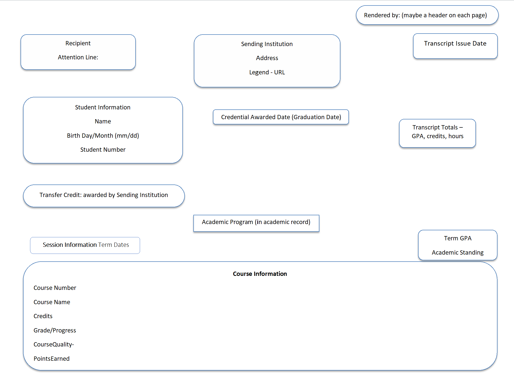
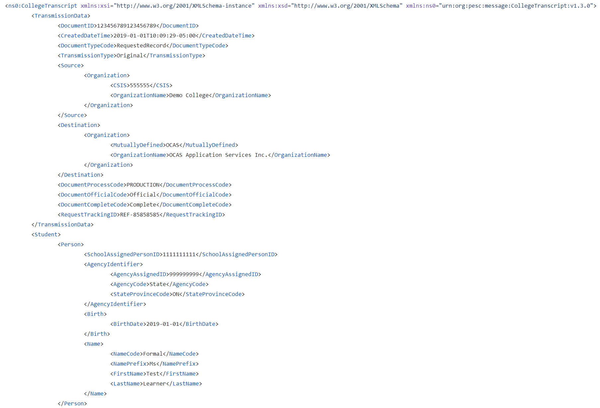
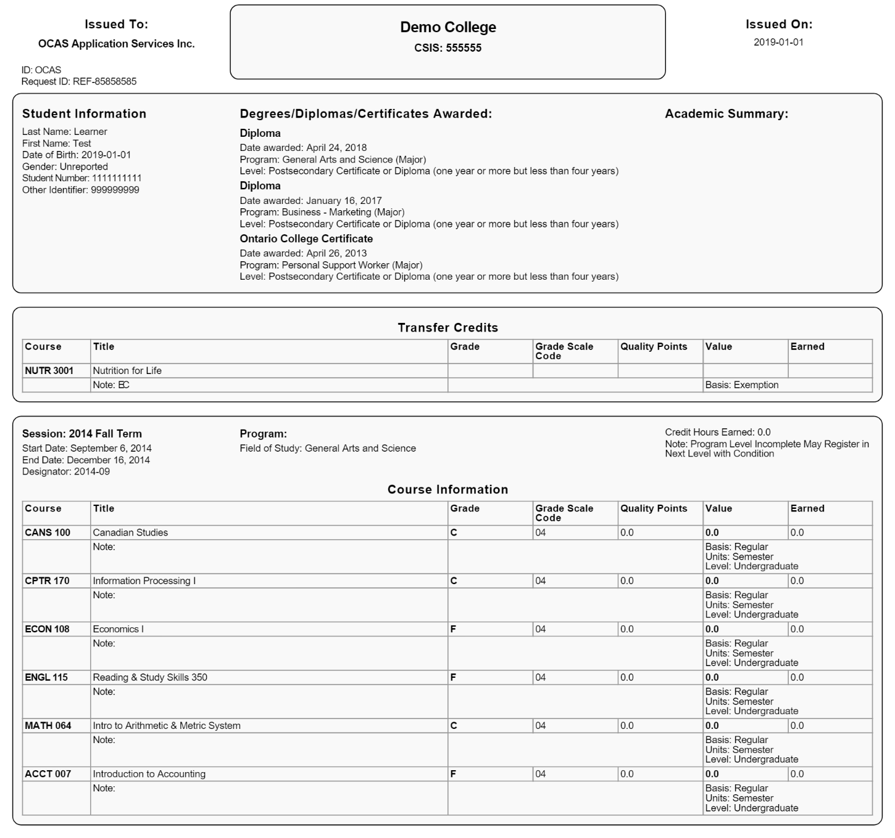

# What is PESC CDL API?

A fully-functional, self-contained service for converting PESC XML transcripts (for College/University and High School) into a standardized, localizable, human-readable PDF format.

## Standardization

The goal of the CanPESC Common Digital Layout (CDL) Working Group (WG) is to devise a standard for presenting transcripts from diverse issuers, enabling admissions staff and others to efficiently find the information they need within a transcript, regardless of source.

This layout standard is presented here, taken from the whitepaper written by the CanPESC CDL Working Group:

From this, the WG created sample tooling to be able to take XML Transcript data such as this:

And render it into a human-readable PDF format such as this:

For more information about the origin of the Working Group and the CDL, please see the whitepaper hosted on pesc.org.

[Electronic Transcript Data Exchange: Building Common Digital
Layout(s) for PESC XML Transcripts](https://nebula.wsimg.com/756901b746edc14b984e33cd7f067efd?AccessKeyId=4CF7FAE11697F99C9E6B&disposition=0&alloworigin=1)

## Containerization

This project takes the tooling one step further and packages the API to render PDFs from Transcripts into containers that can be hosted by any organization without having to develop their own CDL tooling.

For details on how to run and use the containers, start at [Installation](getting-started/installation)